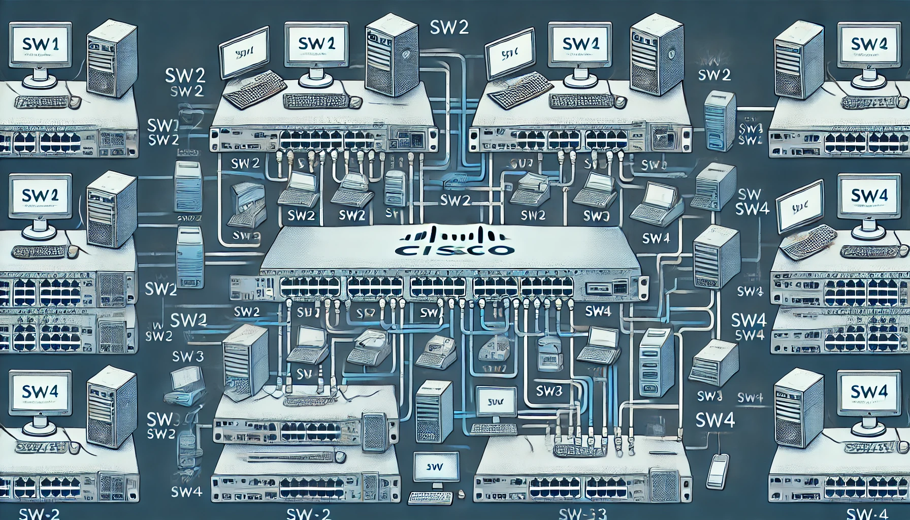

---
# https://vitepress.dev/reference/default-theme-home-page
layout: home

hero:
  name: "MODERN Cloud Administrator Test Dingensworkflowsworkflowsworkflowsworkflowsworkflowsworkflowsworkflows"
  text: "Wir brauchen Hilfe"
  tagline: "Die ultimative Lösung für Ihre Cloud-Verwaltung"
  actions:
    - theme: brand
      text: Markdown Beispiele
      link: /markdown-examples
    - theme: alt
      text: API Beispiele
      link: /api-examples
    - theme: alt
      text: Spiele
      link: /spiele

features:
  - title: 🛠️ Leistungsstarke Werkzeuge
    details: Nutzen Sie die besten Werkzeuge zur Verwaltung und Optimierung Ihrer Cloud-Infrastruktur.
    image: /images/toolbox.png
  - title: 🔒 Sicherheit an erster Stelle
    details: Unsere Lösungen bieten höchste Sicherheitsstandards, um Ihre Daten zu schützen.
    image: /images/security.png
  - title: 🌐 Globale Reichweite
    details: Verwalten Sie Ihre Cloud-Ressourcen weltweit mit unseren benutzerfreundlichen Tools.
    image: /images/global.png
  - title: 🚀 Blitzschnelle Leistung
    details: Erleben Sie maximale Effizienz und Geschwindigkeit in Ihren Cloud-Operationen.
    image: /images/speed.png
  - title: 📊 Umfangreiche Analysen
    details: Treffen Sie fundierte Entscheidungen mit detaillierten Analysen und Berichten.
    image: /images/analytics.png
  - title: 🤝 Kundensupport rund um die Uhr
    details: Unser Support-Team steht Ihnen jederzeit zur Verfügung, um Ihre Fragen zu beantworten.
    image: /images/support.png
  - title: 🎮 Lustige Spiele
    details: Machen Sie eine Pause und genießen Sie einige unterhaltsame Spiele.
    image: /images/games.png

footer:
  copyright: © 2024 Modern Cloud Administrator. All Rights Reserved.
  links:
    - text: Über uns
      link: /about
    - text: Kontakt
      link: /contact
    - text: Datenschutz
      link: /privacy
    - text: Spiele
      link: /spiele
---

## Willkommen

Willkommen auf der offiziellen Seite des Modern Cloud Administrator Test Dingens. Hier finden Sie alle Informationen und Ressourcen, die Sie benötigen, um Ihre Cloud-Umgebung effizient und sicher zu verwalten.

## Schnellstart

### 1. Markdown Beispiele

Erfahren Sie, wie Sie mit Markdown verschiedene Inhalte stilvoll und funktional präsentieren können. [Hier klicken](/markdown-examples)

### 2. API Beispiele

Entdecken Sie die Leistungsfähigkeit unserer APIs und wie Sie diese in Ihre Anwendungen integrieren können. [Hier klicken](/api-examples)

### 3. Lustige Spiele

Machen Sie eine Pause und spielen Sie ein paar Spiele zur Entspannung. [Hier klicken](/spiele)

## Features im Detail

### 🛠️ Leistungsstarke Werkzeuge

Unsere Plattform bietet eine breite Palette an Werkzeugen, die speziell entwickelt wurden, um Ihre Cloud-Verwaltung zu optimieren und zu vereinfachen.

### 🔒 Sicherheit an erster Stelle

Mit modernster Sicherheitstechnologie gewährleisten wir den Schutz Ihrer sensiblen Daten und Ressourcen.

### 🌐 Globale Reichweite

Egal, wo auf der Welt Sie sich befinden, unsere Lösungen sind darauf ausgelegt, Ihnen jederzeit und überall die beste Leistung zu bieten.

### 🚀 Blitzschnelle Leistung

Profitieren Sie von hochperformanten Lösungen, die Ihre Cloud-Operationen beschleunigen und Ihre Produktivität steigern.

### 📊 Umfangreiche Analysen

Nutzen Sie detaillierte Berichte und Analysen, um Ihre Cloud-Strategien zu verfeinern und bessere Geschäftsentscheidungen zu treffen.

### 🤝 Kundensupport rund um die Uhr

Unser engagiertes Support-Team ist stets bereit, Ihnen bei allen Fragen und Anliegen zu helfen.

### 🎮 Lustige Spiele

Gönnen Sie sich eine Pause mit unseren unterhaltsamen Spielen, die Sie direkt auf unserer Website spielen können.

---

Mit diesen Ergänzungen und Verbesserungen haben Sie nun eine ansprechende und informative Startseite für Ihre VitePress-Dokumentation, die auch Spaß und Unterhaltung bietet. Fügen Sie diesen Text einfach in Ihre Markdown-Datei ein und genießen Sie die neuen Features!